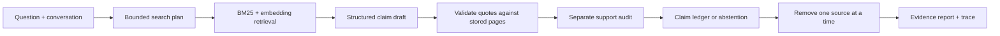

# SourceMind · Evidence Lab

Private document research with answers you can inspect: page-level citations, a claim ledger, cross-PDF disagreements and a source-removal stress test.

**[Live app](https://adaptive-rag1.streamlit.app/)** · [Setup](README_SETUP.md) · [Interview walkthrough](docs/INTERVIEW.md) · [Release runbook](docs/RELEASE.md)

Upload the two [synthetic demo PDFs](output/pdf) for a real ingestion demonstration: both put the facts on page 2, disagree on 2025 revenue and agree on document storage.

## What makes this project distinctive

An ordinary RAG demo retrieves passages and generates an answer. SourceMind exposes the evidence dependencies of that answer:

1. **Adaptive search:** simple questions search directly; comparisons, follow-ups and Forensic mode plan up to three searches.
2. **Hybrid retrieval:** BM25 preserves exact names/numbers; normalized MiniLM embeddings retrieve paraphrases. Reciprocal rank fusion combines rankings and caps passages per source.
3. **Claim gates:** proposed claims require a quotation from the cited passage. A separate model call checks whether each quote actually supports the claim. Unsupported claims are withheld; audit failures abstain.
4. **PDF disagreement analysis:** topical cross-document passage pairs include near duplicates with different numbers. Findings include both quotes/pages and distinguish incompatible claims from different scopes and historical changes.
5. **Source stress test:** remove each document's citations and count which claims lose all support. Several chunks of the same PDF count as one document. In authenticated chat, you can also run a full omission experiment: re-retrieve, draft and audit with one chosen document excluded, then inspect the alternative answer without overwriting the original.
6. **Visible trace:** inspect searches, retrieval diagnostics, accepted/rejected claims, latency, call count and downloadable JSON reports.

This is a distinctive combination of known techniques, not a claim of unprecedented research. The stress test measures **citation dependency**, not whether a claim is objectively true. Two documents may copy the same underlying source. Exact quote checks are deterministic; semantic support and contradiction classification remain model assessments.



## Reliable accounts and storage

- Supabase email accounts, confirmation and recovery; optional Google PKCE login.
- Every browser session owns its Supabase client. JWTs are validated and rotated refresh tokens saved. Sign-out clears uploads, history and auth state.
- Postgres stores **both document metadata and passages/embeddings**. Hosting restarts do not erase retrieval evidence.
- RLS restricts every table to the authenticated owner. Composite foreign keys prevent cross-user document/conversation references. The app never uses a service-role key.
- Ingestion is an atomic database transaction with per-user deduplication and a 3,000-passage quota. PDFs stay separate in multi-file uploads; fingerprints cover all pages.

## Run

```powershell
python -m pip install -r requirements.txt
Copy-Item .env.example .env
# Configure the ignored .env and apply the SQL upgrade described in README_SETUP.md.
python -m streamlit run app.py
```

Without credentials, the public Evidence Lab demonstrates the pipeline on synthetic fixtures. It is explicitly labeled as a deterministic demonstration, not a live-model benchmark.

## Verify

```powershell
python -m pip install -r requirements-dev.txt
python -m pytest -q
npm install --prefix .test-tools --no-audit --no-fund @electric-sql/pglite@0.5.8
node tests/check_database.mjs
```

Tests cover fabricated quotes, bad/missing audits, abstention, hybrid retrieval, source dependency, near-identical numeric contradictions, PKCE expiry/replay, session refresh, PDF page boundaries and actual PostgreSQL RLS/atomicity semantics in an isolated PGlite database. CI runs these without production secrets.

## Practical limits

- Designed for a portfolio-scale workspace: at most 500 passages / 200 pages / 15 MB per PDF and 3,000 passages per user. Retrieval runs over that user's corpus in the application process. Move dense retrieval into pgvector and add a dedicated ingestion worker before scaling substantially.
- The contradiction scan is bounded and cannot establish that every passage agrees. It reports checked, failed and unexamined candidate pairs. A higher budget improves coverage without implying exhaustive review.
- Scanned/image PDFs need OCR beforehand. The app rejects empty extraction rather than indexing a fake success.
- Password sessions last for the current Streamlit browser connection. Reloading requires sign-in. Google PKCE state survives a new connection on a single server; pending attempts expire on restart. Multiple replicas need a shared state store.
- Legacy Chroma indexes were local to the hosting server. Metadata-only records are preserved and flagged for original-PDF re-upload; they cannot reconstruct missing text.
- URL ingestion validates public addresses and redirect destinations; deployment egress controls are still necessary to prevent DNS rebinding.
- Source text is sent to Groq for answers/audits/disagreement checks. Local MiniLM embeddings do not send document text to an embedding API.

No fake numerical confidence, invented benchmark scores or universal novelty claims are displayed.
